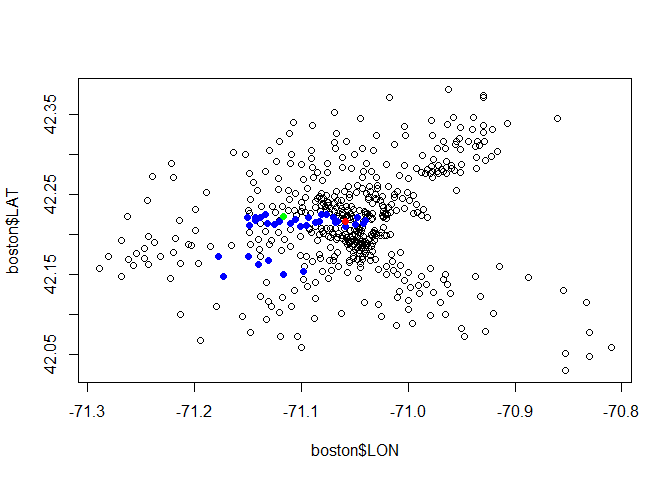
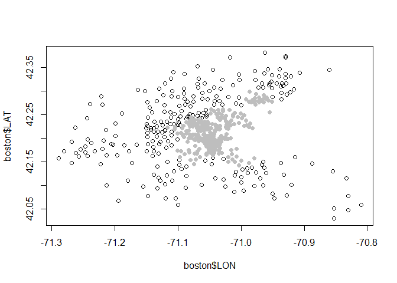
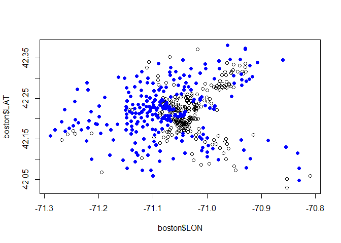

# Boston Real Estate
Ke Li  
March 1, 2016  
## Read in the dataset

```r
boston = read.csv("DataSets/boston.csv")
str(boston)
```

```
## 'data.frame':	506 obs. of  16 variables:
##  $ TOWN   : Factor w/ 92 levels "Arlington","Ashland",..: 54 77 77 46 46 46 69 69 69 69 ...
##  $ TRACT  : int  2011 2021 2022 2031 2032 2033 2041 2042 2043 2044 ...
##  $ LON    : num  -71 -71 -70.9 -70.9 -70.9 ...
##  $ LAT    : num  42.3 42.3 42.3 42.3 42.3 ...
##  $ MEDV   : num  24 21.6 34.7 33.4 36.2 28.7 22.9 22.1 16.5 18.9 ...
##  $ CRIM   : num  0.00632 0.02731 0.02729 0.03237 0.06905 ...
##  $ ZN     : num  18 0 0 0 0 0 12.5 12.5 12.5 12.5 ...
##  $ INDUS  : num  2.31 7.07 7.07 2.18 2.18 2.18 7.87 7.87 7.87 7.87 ...
##  $ CHAS   : int  0 0 0 0 0 0 0 0 0 0 ...
##  $ NOX    : num  0.538 0.469 0.469 0.458 0.458 0.458 0.524 0.524 0.524 0.524 ...
##  $ RM     : num  6.58 6.42 7.18 7 7.15 ...
##  $ AGE    : num  65.2 78.9 61.1 45.8 54.2 58.7 66.6 96.1 100 85.9 ...
##  $ DIS    : num  4.09 4.97 4.97 6.06 6.06 ...
##  $ RAD    : int  1 2 2 3 3 3 5 5 5 5 ...
##  $ TAX    : int  296 242 242 222 222 222 311 311 311 311 ...
##  $ PTRATIO: num  15.3 17.8 17.8 18.7 18.7 18.7 15.2 15.2 15.2 15.2 ...
```
  + Per capita crime rate
  + Proportion of area used for industry
  + census track
  + concentration of Nitrious Oxides in the air
  + average rooms per dwelling
  + proportion of owner-occupied units built before 1940
  + how far the tract is from center of employment in Boston
  + is measure of closeness to important highways
  + property tax rate per $10,000 of value
  + pupil-teacher ratio by town
  
  ...

## Exploratary Data Analaysis - Geography


```r
# Boston Map Reflection
plot(boston$LON, boston$LAT)
# Charles River
points(boston$LON[boston$CHAS==1], boston$LAT[boston$CHAS==1], col="blue", pch=19)
# MIT
points(boston$LON[boston$TRACT==3531], boston$LAT[boston$TRACT==3531], col="red", pch=19)
# Watertown, my house
points(boston$LON[boston$TRACT==3701], boston$LAT[boston$TRACT==3701], col="green", pch=19)
```



## Air Pollution

```r
summary(boston$NOX)
```

```
##    Min. 1st Qu.  Median    Mean 3rd Qu.    Max. 
##  0.3850  0.4490  0.5380  0.5547  0.6240  0.8710
```

```r
# Boston Map Reflection
plot(boston$LON, boston$LAT)
# NOX concentration
points(boston$LON[boston$NOX>0.53], boston$LAT[boston$NOX>0.53], col="grey", pch=19)
```



## Housing Price

```r
summary(boston$MEDV)
```

```
##    Min. 1st Qu.  Median    Mean 3rd Qu.    Max. 
##    5.00   17.02   21.20   22.53   25.00   50.00
```

```r
# Boston Map Reflection
plot(boston$LON, boston$LAT)
# NOX concentration
points(boston$LON[boston$MEDV>21.20], boston$LAT[boston$MEDV>21.20], col="blue", pch=19)
```



